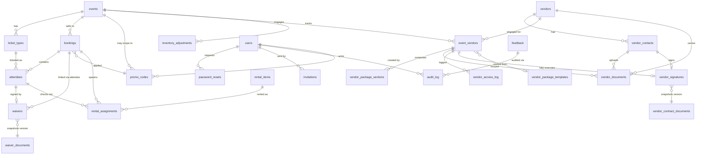

# 03 — Data Model

D1 (SQLite) schema as of migration `0019_event_per_surface_images.sql`. All claims here are derived from reading the migration files in [migrations/](migrations) end-to-end. Row counts are not directly observable from this audit (no production access); HANDOFF §12 estimates are noted where applicable but not authoritative.

## Migration history

20 files, forward-only, no down-migrations. The wrangler runner applies them in **alphabetic-by-filename** order — relevant because two files share the `0010` prefix:

| # | File | Adds |
|---|---|---|
| 1 | `0001_initial.sql` | `events`, `bookings`, `waivers`, `users`, `admin_sessions`, `inventory_adjustments` |
| 2 | `0002_expanded_schema.sql` | `ticket_types`, `attendees`, `promo_codes`, `email_templates`, `rental_items`, `rental_assignments`, `audit_log`; ALTERs on `events`/`bookings`/`waivers` |
| 3 | `0003_pending_attendees.sql` | `bookings.pending_attendees_json` |
| 4 | `0004_taxes_fees.sql` | `taxes_fees` table + 3 inactive seeds |
| 5 | `0005_password_resets.sql` | `password_resets` |
| 6 | `0006_reminders.sql` | `bookings.reminder_sent_at` + `tpl_event_reminder_24h` template |
| 7 | `0007_reminder_1hr.sql` | `bookings.reminder_1hr_sent_at` + `tpl_event_reminder_1hr` template |
| 8 | `0008_team_invites.sql` | `invitations` + `tpl_user_invite` template |
| 9 | `0009_custom_questions.sql` | `events.custom_questions_json`, `attendees.custom_answers_json` |
| 10a | `0010_session_version.sql` | `users.session_version` (closes SECURITY_AUDIT MED-9/10) |
| 10b | `0010_vendors.sql` | `vendors`, `vendor_contacts`, `event_vendors`, `vendor_package_sections`, `vendor_documents`, `vendor_access_log` + `et_vendor_package_sent` template |
| 11 | `0011_waiver_hardening.sql` | `waiver_documents` + ALTERs `waivers` to add at-sign snapshot fields + seeds `wd_v1` |
| 12 | `0012_vendor_v1.sql` | `vendor_package_templates`, `vendor_contract_documents`, `vendor_signatures` + ALTERs to `event_vendors`, `vendor_documents`, `vendor_contacts`, `vendors` + 6 vendor email templates |
| 13 | `0013_feedback.sql` | `feedback` + `et_admin_feedback_received` template |
| 14 | `0014_feedback_attachment.sql` | `feedback.attachment_*` columns + `et_feedback_resolution_notice` template |
| 15 | `0015_drop_event_tax_columns.sql` | **DROPs** `events.tax_rate_bps` and `events.pass_fees_to_customer` |
| 16 | `0016_booking_payment_method.sql` | `bookings.payment_method` + backfill rules |
| 17 | `0017_event_featured.sql` | `events.featured` |
| 18 | `0018_waiver_v4_fields.sql` | 10 new columns on `waivers` (4-tier age, supervising adult, jury-trial initials, claim period) + `idx_waivers_claim_lookup` |
| 19 | `0019_event_per_surface_images.sql` | `events.card_image_url`, `hero_image_url`, `banner_image_url`, `og_image_url` |

> **Anomaly**: two files named `0010_*`. They are independent (one ALTERs `users`, the other creates 6 vendor tables) so there is no functional risk, but the numbering collision is fragile — Wrangler resolves by alphabetic order, which puts `session_version` before `vendors` deterministically. Reflagging from Area 1; will reflag in Area 8.

> **Concerning operation**: migration 0015 uses `ALTER TABLE events DROP COLUMN`. SQLite supports this since 3.35 and D1 supports it, but it's irreversible without a manual restore. If the audit/reset team ever rolls back to <0015, the DB cannot easily be reconstructed from migration files alone.

## Table inventory

| # | Table | One-line purpose | Created in |
|---:|---|---|---|
| 1 | `events` | Airsoft events (one row per event) | 0001 |
| 2 | `ticket_types` | Per-event ticket tiers | 0002 |
| 3 | `bookings` | Customer purchases | 0001 |
| 4 | `attendees` | Individual players inside a booking; one QR per row | 0002 |
| 5 | `waivers` | Signed waiver tied to an attendee; immutable once signed | 0001 + heavy ALTERs in 0002/0011/0018 |
| 6 | `waiver_documents` | Versioned waiver source-of-truth (live row = `retired_at IS NULL`) | 0011 |
| 7 | `users` | Admin accounts | 0001 |
| 8 | `admin_sessions` | **Legacy/dead** — sessions live in HMAC-signed cookies now (per HANDOFF §6) | 0001 |
| 9 | `password_resets` | Single-use 1hr reset tokens | 0005 |
| 10 | `invitations` | Single-use 7d invite tokens | 0008 |
| 11 | `promo_codes` | Discount codes (percent / fixed) | 0002 |
| 12 | `taxes_fees` | Global tax/fee rows applied to every checkout | 0004 |
| 13 | `email_templates` | Editable transactional email templates | 0002 |
| 14 | `rental_items` | Physical equipment pool | 0002 |
| 15 | `rental_assignments` | Which item went to which attendee | 0002 |
| 16 | `inventory_adjustments` | Manual stock overrides (event-scoped) | 0001 |
| 17 | `audit_log` | Who did what, when | 0002 |
| 18 | `vendors` | Company-level vendor record | 0010_vendors |
| 19 | `vendor_contacts` | People at a vendor (one `is_primary` per vendor) | 0010_vendors |
| 20 | `event_vendors` | Per-(event, vendor) package + token state machine | 0010_vendors |
| 21 | `vendor_package_sections` | Composable content blocks for a package | 0010_vendors |
| 22 | `vendor_documents` | Files attached to a package or vendor | 0010_vendors |
| 23 | `vendor_access_log` | Tokenized vendor-side actions (view/download), separate from admin `audit_log` | 0010_vendors |
| 24 | `vendor_package_templates` | Reusable starter packages (admin UI deferred per HANDOFF §11) | 0012 |
| 25 | `vendor_contract_documents` | Versioned vendor contract source (same `retired_at IS NULL` pattern) | 0012 |
| 26 | `vendor_signatures` | Per-package signed contract; immutable at-sign snapshot | 0012 |
| 27 | `feedback` | User-submitted tickets (bug / feature / usability / other) | 0013 |

## Primary key strategy

| Strategy | Tables |
|---|---|
| TEXT PRIMARY KEY (prefixed cuid-like ID, e.g. `ev_*`, `bk_*`, `att_*`, `vnd_*`, `vct_*`, `evnd_*`, `vps_*`, `vdoc_*`, `vsig_*`, `vtpl_*`, `vcd_*`, `wd_*`, `tt_*`, `tf_*`, `pc_*`, `tpl_*`, `et_*`, `inv_*`, `ri_*`, `ra_*`, `fb_*`) | events, ticket_types, bookings, attendees, waivers, waiver_documents, users, admin_sessions, password_resets, invitations, promo_codes, taxes_fees, email_templates, rental_items, rental_assignments, vendors, vendor_contacts, event_vendors, vendor_package_sections, vendor_documents, vendor_package_templates, vendor_contract_documents, vendor_signatures, feedback |
| INTEGER PRIMARY KEY AUTOINCREMENT | inventory_adjustments, audit_log, vendor_access_log |

ID generation lives in [worker/lib/ids.js](worker/lib/ids.js) (verified by Glob; will read in Area 4).

## Entity relationship diagram (Mermaid)

> Every mutation handler in `worker/routes/admin/*` writes an `audit_log` row; relationships shown above are the strong ones modelled in schema.

## Indexes — hot paths

Indexes that matter for query performance, derived from explicit `CREATE INDEX` statements:

| Index | Table | Columns | Purpose |
|---|---|---|---|
| `idx_events_published_date` | events | (published, date_iso) | `/api/events` listing |
| `idx_bookings_event_status` | bookings | (event_id, status) | Roster & analytics |
| `idx_bookings_email` | bookings | (email) | Customer lookup by email |
| `idx_bookings_created` | bookings | (created_at) | Recent-bookings filter |
| `idx_bookings_stripe_session` | bookings | (stripe_session_id) | Webhook lookup |
| `idx_bookings_payment_method` | bookings | (payment_method, created_at DESC) | Method-filtered admin view |
| `idx_attendees_booking` | attendees | (booking_id) | "Show attendees for booking" |
| `idx_attendees_ticket_type` | attendees | (ticket_type_id) | Ticket-type-aware analytics |
| `idx_attendees_qr` | attendees | (qr_token) UNIQUE implicit | Scanner lookup |
| `idx_waivers_booking` | waivers | (booking_id) | Booking-detail lookup |
| `idx_waivers_email` | waivers | (email) | Email lookup |
| `idx_waivers_claim_lookup` | waivers | (email, player_name, claim_period_expires_at) | Phase-C auto-link `findExistingValidWaiver` |
| `idx_waiver_documents_live` | waiver_documents | (retired_at, version) | Live-row lookup |
| `idx_ticket_types_event` | ticket_types | (event_id, active, sort_order) | Event-detail render |
| `idx_promo_codes_event` | promo_codes | (event_id, active) | Promo apply |
| `idx_taxes_fees_active` | taxes_fees | (active, sort_order) | Quote pricing |
| `idx_rental_items_sku`, `idx_rental_items_category` | rental_items | various | Rentals admin |
| `idx_rental_assignments_item`, `_attendee`, `_booking` | rental_assignments | various | Assignment lookup |
| `idx_audit_log_user`, `idx_audit_log_target` | audit_log | (user_id, created_at), (target_type, target_id) | Audit queries |
| `idx_password_resets_user`, `_expires` | password_resets | various | Token lookup |
| `idx_sessions_user`, `_expires` | admin_sessions | various | (table is dead — no longer used) |
| `idx_invitations_email` | invitations | (email, consumed_at, revoked_at) | Invite-by-email lookup |
| `idx_vendors_active` | vendors | (deleted_at, company_name) | Active vendor list |
| `idx_vendor_contacts_vendor` | vendor_contacts | (vendor_id, deleted_at) | Vendor-contact list |
| `idx_vendor_contacts_email` (UNIQUE WHERE deleted_at IS NULL) | vendor_contacts | (vendor_id, email) | One email per vendor |
| `idx_event_vendors_event`, `_vendor` | event_vendors | (event_id, status), (vendor_id) | Per-event package list |
| `idx_vendor_sections_ev` | vendor_package_sections | (event_vendor_id, sort_order) | Composer ordering |
| `idx_vendor_docs_ev`, `_vendor` | vendor_documents | various | Document scope |
| `idx_vendor_access_ev` | vendor_access_log | (event_vendor_id, created_at DESC) | Most-recent access |
| `idx_vendor_templates_active` | vendor_package_templates | (deleted_at, name) | Template picker |
| `idx_vendor_contracts_live` | vendor_contract_documents | (retired_at, version) | Live-contract lookup |
| `idx_vendor_signatures_ev`, `_contact` | vendor_signatures | various | Signature lookup |
| `idx_feedback_status`, `_created`, `_type` | feedback | various | Triage filters |

### Indexes that look missing

The audit found a few queries whose indexes look thin or absent:

- **`bookings.stripe_payment_intent`** — used by Stripe webhooks for refund/cancel correlation, but only `stripe_session_id` is indexed. Worker-side query exists in `worker/routes/webhooks.js` (will read in Area 4 to confirm the index need).
- **`audit_log.action`** — `idx_audit_log_target` covers `(target_type, target_id)` but the cron-status endpoint scans for `action = 'cron.swept'` (and admin filters by action name in `/admin/audit-log`). With volume those become full-scan over time.
- **`events.slug`** — looked up in [worker/index.js:453-457](worker/index.js) on every `/events/:slug` request via `WHERE id = ? OR slug = ?`. The `id`-equality side hits the PK index; the `slug` side is a full scan. Today the table has a single row, so this is fine — but as events accumulate this is a hot path with no covering index.

Flag for Area 8.

## Soft-delete vs hard-delete patterns

| Pattern | Tables | Column |
|---|---|---|
| Soft delete (timestamp marker) | `vendors`, `vendor_contacts`, `vendor_package_templates` | `deleted_at` |
| Soft delete (boolean flag) | `rental_items` (`active=0` + `retired_at`), `users` (`active=0`), `email_templates` (no flag), `taxes_fees` (`active=0`), `ticket_types` (`active=0`) | various |
| Soft delete via status | `event_vendors` (`status='revoked'`), `bookings` (`status='cancelled'`/`'abandoned'`), `feedback` (`status='resolved'`/`'wont-fix'`/etc.) | `status` |
| Hard delete with archival fallback | `events` (`DELETE /api/admin/events/:id` archives if any bookings exist, deletes otherwise — see [admin/events.js:443](worker/routes/admin/events.js)) | n/a |
| Pure hard delete | `attendees`, `waivers`, `audit_log`, `vendor_access_log`, `password_resets`, `invitations`, `inventory_adjustments`, `rental_assignments`, `vendor_signatures`, `vendor_documents` | n/a |

> Notable: signed waivers and vendor signatures are hard-deletable via cascade. There is no DB-level guard preventing a future operator from deleting `attendees` rows that have associated `waivers` (the FK on `waivers.attendee_id` was added without a CASCADE clause, and SQLite doesn't enforce FK actions unless enabled per-connection — D1 does enable them, but the columns lack `ON DELETE` clauses, so behavior is the SQLite default of `NO ACTION`). Worth flagging in Area 8 because the legal posture of the waiver system depends on the row being unmolested.

## Audit columns

| Pattern | Tables |
|---|---|
| `created_at` (ms epoch INT) on every row | All tables (consistent) |
| `updated_at` | events, ticket_types, vendors, vendor_package_sections, taxes_fees, email_templates, vendor_package_templates, feedback |
| `created_by` (FK users) | promo_codes, waiver_documents, vendor_package_templates, vendor_contract_documents |
| `deleted_at` | vendors, vendor_contacts, vendor_package_templates |
| Versioning (`version UNIQUE`, `effective_from`, `retired_at`) | waiver_documents, vendor_contract_documents |
| Sentinel-stamped reminder columns | bookings (`reminder_sent_at`, `reminder_1hr_sent_at`), vendors (`coi_reminder_30d_sent_at`, `coi_reminder_7d_sent_at`), event_vendors (`package_reminder_sent_at`, `signature_reminder_sent_at`) |

## Audit-log retention

**There is no retention policy.** No DELETE statement against `audit_log` exists in any migration, route handler, or cron sweep (verified by Grep: zero matches for `DELETE FROM audit_log`). The `cron.swept` row added in HANDOFF §10's "smaller polish wave" runs every 15 minutes — that's 4 rows/hour, 96 rows/day, ~35K rows/year just from cron heartbeats, on top of every admin mutation.

Implication: the table will grow indefinitely. D1 currently has generous limits (10 GB per database) but this becomes a soft pain point over years. **Flag for Area 8.**

## Validating against JD-implied operational entities

The JDs imply these operational concepts. Cross-referencing presence in schema:

| JD entity | Schema entity | Status |
|---|---|---|
| Events | `events` | ✓ |
| Event sessions / games | `events.game_modes_json` (TEXT JSON blob) | partial — stored inline; no normalized table for game-level data, queries, or analytics |
| Ticket tiers | `ticket_types` | ✓ |
| Customers | implicit (email + name on `bookings`; same email on multiple bookings = same customer) | ❌ no dedicated `customers` table — repeat-customer analytics impossible without GROUP BY email |
| Bookings | `bookings` | ✓ |
| Attendees | `attendees` | ✓ |
| Waivers | `waivers` | ✓ |
| Waiver documents (versioned) | `waiver_documents` + at-sign snapshot fields on `waivers` | ✓ |
| Signed waivers | `waivers` (every row is signed by definition — no draft state) | ✓ |
| Payments | implicit (`bookings.stripe_session_id`, `stripe_payment_intent`, `payment_method`) | partial — no dedicated `payments` / `transactions` table; can't track multiple captures or partial refunds independently |
| Refunds | implicit (`bookings.refunded_at` timestamp; no refund record) | ❌ no `refunds` table; cannot track partial refunds, refund reasons, or multiple refunds against a single booking |
| Sites / venues | `events.site` (TEXT free-form), `events.location` (TEXT) | ❌ **no `sites` / `venues` table**. Static `src/data/locations.js` holds 3 sites. JDs and HANDOFF talk about Ghost Town / Foxtrot Fields / Echo Urban — these are strings, not entities. |
| Staff / users | `users` | ✓ |
| Role assignments | `users.role` enum (owner/manager/staff) | ✓ — single role per user; no role-history or per-event role overrides |
| Rental inventory | `rental_items` + `rental_assignments` | ✓ |
| Certifications | nothing | ❌ no `certifications` / `staff_certifications` table — JDs talk about CPR, EMT, WFR, Stop the Bleed certs but there's no DB record of who holds what |
| Vendors | `vendors`, `vendor_contacts`, `event_vendors` | ✓ |
| Sponsors | nothing | ❌ vendors and sponsors are conflated; there is no separate sponsor concept |
| Audit log | `audit_log` | ✓ |
| Feedback | `feedback` | ✓ |
| Attachments | `feedback.attachment_*` columns + `vendor_documents` | partial (only feedback + vendor have attachment models) |
| Weapon classes | nothing | ❌ no `weapon_classes` enum or table — Rifle 350 / DMR 450 / LMG 450 / Sniper 550 are static markdown on `/rules-of-engagement`. Pricing, restrictions, and per-class rules are not first-class data. |

### Gap summary

The JDs imply **6 operational concepts that do not exist as schema**: sites/venues, customers (as a join entity), payments/transactions, refunds (as a join entity), certifications, sponsors, weapon classes. Whether any are blocking depends on the admin overhaul scope; flag in Area 8 for prioritization.

## Row counts (estimates only — not from production)

Per HANDOFF §12 the live database has approximately:

| Table | Estimated rows |
|---|---|
| events | 1 (`operation-nightfall`) |
| ticket_types | 1 |
| bookings | unknown; HANDOFF mentions smoke/dogfood data only |
| attendees | unknown |
| waivers | conflicting docs: HANDOFF.md §12 says "no signed waivers yet"; migration 0011 comment says "the live DB has no signed waivers yet"; migration 0018 comment says "4 smoke/dogfood rows on wd_v1". Treat as 4 dogfood rows. |
| waiver_documents | 4 (`wd_v1` retired, `wd_v2` retired, `wd_v3` retired, `wd_v4` live) per HANDOFF §12 |
| users | ≥1 (Paul as owner) |
| email_templates | 16 (per HANDOFF §12) |
| taxes_fees | 3 inactive seeds + admin-configured rows |
| rental_items, rental_assignments, promo_codes, invitations, password_resets | unknown |
| audit_log | accumulating; per HANDOFF §10 "Reminder-cron monitoring" the cron.swept rows have been firing since that change shipped — call it ~35K so far |
| vendors, vendor_contacts, event_vendors, vendor_documents, vendor_signatures, vendor_contract_documents | 0 per HANDOFF §12 |
| feedback | 5 resolved (4 dogfood + 1 ROE), 0 open per HANDOFF §12 |

Verifying these would require a `wrangler d1 execute --remote` query, which this read-only audit deliberately does **not** run. Flag for Area 10 as a runtime-investigation question if accuracy matters.

## Cross-area follow-ups

- **Area 4** (Integrations): the waiver-document SHA-256 integrity check is referenced here; verify code path.
- **Area 4**: `vendor_documents.kind` lacks a CHECK constraint after 0012's ALTER (SQLite can't add CHECK via ALTER). Route layer is supposed to enforce — verify.
- **Area 6**: every table with a `body_html_snapshot` + `body_sha256` column pair is legally load-bearing (waivers, vendor_signatures). These rows are `do not touch` artifacts.
- **Area 8**: 6 missing operational entities, 3 absent indexes, audit-log unbounded growth, dead `admin_sessions` table, two `0010_*` migrations, post-0015 rollback impossibility.
- **Area 10**: confirm row counts with a single `SELECT count(*) FROM <table>` per table — but not in this phase.
